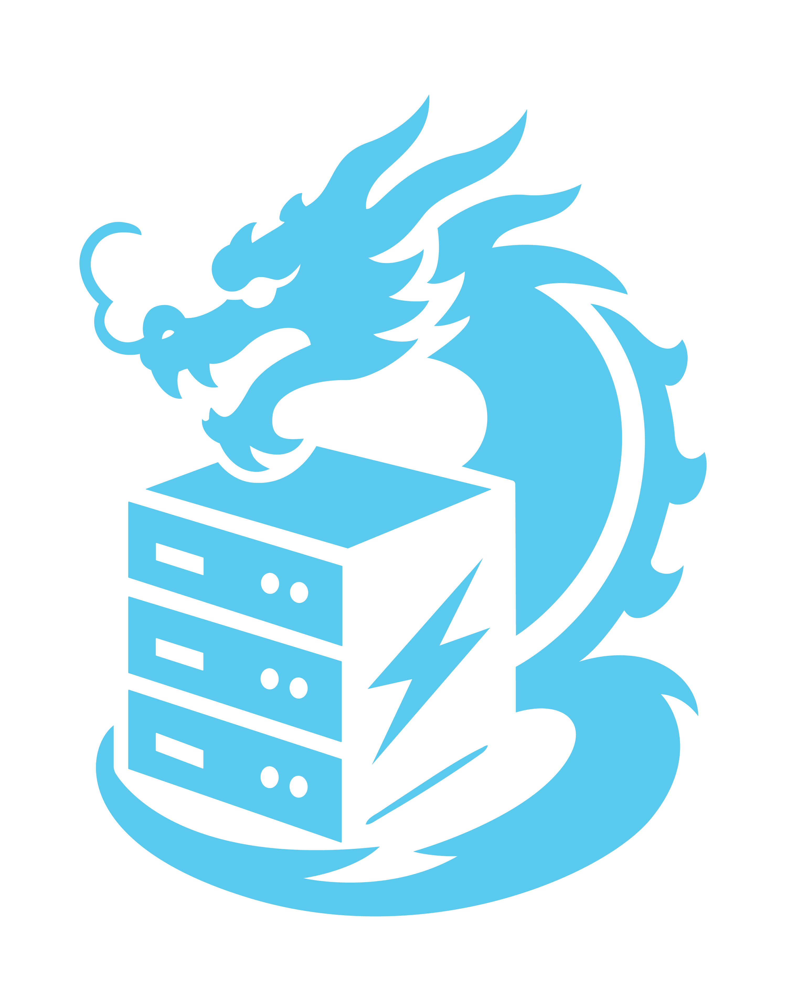

# Drukbox

<!-- markdownlint-disable-next-line MD033 -->
<p align="center">
  
</p>

Drukbox is a FastAPI service that provisions sandbox hosts.

Sandbox and VM providers are many and change quickly. Drukbox keeps them
behind a stable API: each provider is an adapter, so switching or adding
one is a config change, not a migration.

It owns the sandbox lifecycle end to end: host records and state in
Postgres, inline provisioning in `POST /hosts`, provider VM creation
and teardown, optional Tailscale networking, and the `ssh-keyscan`
material callers need to connect. It hands back SSH coordinates and
stops there — drukbox does not speak SSH and does not own a runtime
inside the VM.

## Quickstart

No cloud account needed — run Drukbox from source on the host, so the
`docker` provider can reach the local Docker daemon and run sandboxes as
local containers:

```bash
git clone https://github.com/czpython/drukbox.git
cd drukbox && uv sync
make dev
```

Then create a sandbox from another terminal:

```bash
curl -fsS -H "Authorization: Bearer dev-token" \
  -X POST http://localhost:8000/hosts
```

The response includes the SSH host, port, username, private key, and
`known_hosts` material needed to connect. A running service also serves
interactive API docs at <http://localhost:8000/docs>.

## Documentation

- [API](docs/api.md) — endpoints, auth, and the OpenAPI reference.
- [Architecture](docs/architecture.md) — the broker model, boundaries,
  the provider contract, capabilities, lifecycle.
- [Networking](docs/networking.md) — Tailscale vs public path, key
  material, security groups, `known_hosts`.
- [Deploy](docs/deploy.md) — image, cron jobs, migrations, IAM, and
  the full configuration reference.
- [Security](docs/security.md) — trust model, auth, secret and
  metadata handling, and the tradeoffs behind each default.
- [Add a provider](docs/add-a-provider.md) — integrating a new VM
  provider.

## Development

```bash
uv sync
uv run ruff check
uv run ruff format --check
uv run pyright
uv run pytest
```

`uv run pytest` loads non-secret test settings from `env/test.env` via
`src/conftest.py`; CI runs the same checks plus a Docker image build.

`api-tests/` is a Playwright black-box suite for an already-running
deployment — it provisions a real host, so point it at disposable
infrastructure only (see [Deploy](docs/deploy.md#verify)).
